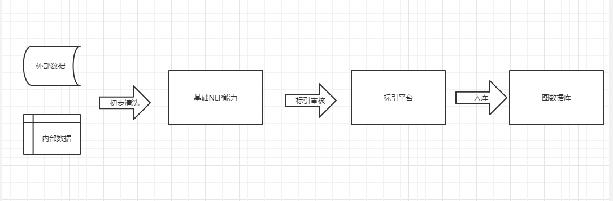

# Knowledge_Graph
构建法律行业的知识图谱

------------------------------------------------------------------------------------------
## 目录

- [1.知识图谱基础](#1.知识图谱基础)
  - [1.1 什么是知识图谱](#1.1什么是知识图谱)
  - [1.2 知识图谱的特点和优势](#1.2知识图谱的特点和优势)
  - [1.3 知识图谱的分类](#1.3知识图谱的分类)
- [2.构建知识图谱](#2.构建知识图谱)
  - [2.1 涉及到的基础NLP技术](#2.1涉及到的基础NLP技术)
  - [2.2 构建知识图谱的难点](#2.2构建知识图谱的难点)
  - [2.3 构建知识图谱的大概流程](#2.3构建知识图谱的大概流程)
  - [2.4 个人经验分享](#2.4个人经验分享)
  - [2.5 使用开源数据构建知识图谱](#2.5使用开源数据构建知识图谱)
- [声明](#声明)  

## 1.知识图谱基础

### 1.1 什么是知识图谱
知识图谱的概念最早由**谷歌**工程师John Giannandrea在2012年提出。随后，知识图谱成为Google搜索引擎的重要组成部分。

知识图谱是一种用于描述实体之间关系的图形化知识表示方法，它是一种基于语义网技术的知识管理工具。可以看作是一张大规模的、半结构化的、具有语义表达能力的图谱，用于描述真实世界中的实体、概念、事件、事物之间的关系。

知识图谱通常由三元组（主体、谓语、客体）组成，其中主体和客体表示实体或者概念，谓语表示实体之间的关系或者属性。例如，“北京市”是主体，“是首都”是谓词，“中国”是客体，这样的一个三元组可以表示为（北京市，是首都，中国）。

### 1.2 知识图谱的特点和优势
- 结构化表示：知识图谱采用图形结构来组织实体、属性和关系，实现了知识的结构化表示，便于机器自动理解和处理。

- 语义丰富：知识图谱中的实体、属性和关系都有对应的语义标签，可以对实体和关系进行语义化的描述，从而丰富了知识的表达能力。

- 可扩展性：知识图谱的结构和内容可以随着新知识的不断加入而不断扩展和更新，可以持续地为应用提供更加准确和全面的知识支持。

- 多模态支持：知识图谱不仅支持文本数据，还可以支持图像、音频、视频等多种数据类型，从而实现了多模态的知识表达和应用。

- 可视化展示：知识图谱可以通过可视化工具进行展示，能够直观地呈现实体之间的关联关系。

- 应用广泛：知识图谱可以应用于各种领域，如智能搜索、智能推荐、智能问答、智能对话等，可以为人工智能的发展提供强大的知识基础和支持

知识图谱在许多领域都有广泛的应用价值，例如搜索引擎、智能客服、智能问答、自然语言处理、语义网、人工智能等领域。其主要价值在于能够将分散、复杂的知识点整合成一张结构化的图谱，方便数据的管理、存储和使用。通过对知识图谱的查询，用户可以快速地找到所需信息，也可以帮助机器更好地理解人类语言。
### 1.3 知识图谱的分类
- 通用知识图谱和专业领域知识图谱：
  - 通用知识图谱涵盖各种领域的知识，例如Freebase和DBpedia；
  - 专业领域知识图谱则集中于特定领域，例如生物医学领域的BioPortal和Snomed CT。

- 术语型知识图谱和实体型知识图谱：
  - 术语型知识图谱主要关注概念和术语之间的关系，例如WordNet和OntoNotes；
  - 实体型知识图谱则关注实体之间的关系，例如YAGO和NELL。

- 层次型知识图谱和网状型知识图谱：
  - 层次型知识图谱将知识组织为一种层次结构，例如招商银行的KG；
  - 网状型知识图谱则使用一种更加复杂的方式来表示实体和关系，例如Google Knowledge Graph和Microsoft Satori。

## 2.构建知识图谱
### 2.1 涉及到的基础NLP技术
构建知识图谱需要用到多种基础的NLP技术，包括但不限于以下几种：

- 分词（Tokenization）：将文本切分成一个个单独的词语。
- 词性标注（Part-of-Speech Tagging）：对文本中的每个词语进行词性标注，例如名词、动词、形容词等。
- 句法分析（Syntactic Parsing）：对文本进行分析，确定单词之间的依存关系，例如句子的主谓宾关系、修饰关系等。
- 命名实体识别（Named Entity Recognition, NER）：从文本中识别出具有特定意义的实体，如人名、地名、组织机构名等。
- 关系抽取（Relation Extraction）：从文本中抽取实体之间的关系，如人与公司的就业关系、物品与价格的关系等。
- 文本分类（Text Classification）：对文本进行分类，例如将文章归为新闻、评论、博客等不同的类别。

以上技术不一定全部需要用到，具体的构建过程会根据具体的场景和目的而有所不同。这些技术可以帮助我们从文本中提取出有用的信息，为构建知识图谱提供基础数据。

### 2.2构建知识图谱的难点
- 1.知识抽取：从各种结构化和非结构化数据源中提取出有用的知识，包括实体、关系、属性等信息。
- 2.实体链接：将文本中提到的实体与知识图谱中的实体进行链接，以确保不同数据源中的实体能够被合并。
- 3.关系抽取：从文本中提取出实体之间的关系，并将其与知识图谱中已有的关系进行比对，以确保正确性。
- 4.知识表示：将从不同数据源中提取出的知识进行统一的表示和存储，以便于知识的共享和查询。
- 5.知识推理：基于知识图谱中已有的知识，进行推理和推断，以发现新的知识和规律。
- 6.可扩展性：知识图谱需要支持动态的数据更新和扩展，以应对不断变化的业务需求。
- 7.数据质量：知识图谱需要保证数据的准确性、完整性、一致性和时效性，以提供高质量的知识服务。

其实困难总结来说就2点：1.高质量结构化数据 2.知识推理
### 2.3 构建知识图谱的大概流程
构建一个知识图谱通常包含以下几个基本流程：

- 1.领域分析和数据收集：确定知识图谱涉及的领域和范围，然后从不同的数据源收集相关数据，这些数据可以是结构化数据（如数据库、CSV文件）或非结构化数据（如文本、图像、视频）。
- 2.数据预处理：将从不同数据源收集的数据进行预处理，包括数据清洗、去重、格式化、规范化等，以便后续处理。
- 3.实体识别和分类：通过NLP技术对数据进行实体识别和分类，例如从文本中识别出人名、地名、组织机构名等。
- 4.关系抽取和建模：基于实体和实体之间的关系，抽取出相关信息，并建立相关关系模型。例如，对于人与公司之间的就业关系，可以抽取出人的名字和公司的名字，并建立就业关系模型。
- 5.知识图谱存储和表示：将构建好的知识图谱存储在图数据库或者RDF数据库中，并进行表示。常见的表示方式有RDF（Resource Description Framework）、OWL（Web Ontology Language）等。
- 6.知识图谱应用和推理：基于已经构建好的知识图谱，进行相关应用和推理，例如问答系统、知识图谱可视化等。

以上流程是构建知识图谱的基本流程，具体的实现过程会根据具体的需求和数据源而有所不同。

### 2.4 个人经验分享
上文介绍了大体构建流程和基础方法:。

在现实工业中，KG的落地要根据公司的现状和资源投入来动态调整的。
- 经验1：

  我们所在的行业，要求KG知识正确率为100%，所以为业务专家们额外开发了一套标引平台，很方便、实用。
  
- 经验2：
  - 对于冷门的NLP基础任务不必投入太大资源，
  - 对于重要的基础任务，比如实体识别，一定要流程拉通且做好，后期做成高质量的通用API并入AI平台。

### 2.5 使用开源数据构建知识图谱

## 声明
本人在撰写文章的过程中郑重声明，所发布的文章不涉及任何公司的机密信息。这些文章仅涉及通用技术和个人的技术观点，旨在与广大读者分享相关领域的知识和经验。

在撰写文章时，本人将遵守相关法律法规，尊重知识产权和商业机密的保护。任何与公司机密相关的信息将被严格保密，并不会在博客文章中进行披露。

本人对博客文章的内容负有责任，并将尽力确保文章的准确性和可靠性。如果读者在阅读过程中发现任何问题或有任何疑问，请随时与本人联系，我将及时进行修正和澄清。

最后，感谢广大读者对我的支持和理解。我将持续努力，为读者提供有价值的技术内容和见解。

此声明即日起生效